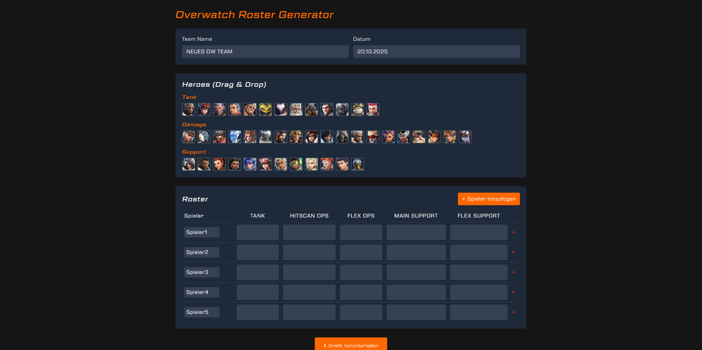

# Overwatch Roster Generator

A web app for building, customizing, and exporting Overwatch team rosters. Drag and drop heroes into player slots, manage hero pools, and export your roster as an image for sharing.

## Features
- **Roster Table:** Assign heroes to players by role using drag-and-drop.
- **Hero Pool:** Select from all available Overwatch heroes, with portraits and custom fonts.
- **Settings Panel:** Customize team name, date, and other options.
- **Export:** Download your roster as a shareable image.
- **Responsive UI:** Built with Vue 3, TailwindCSS, and Pinia for state management.

## Demo


## Getting Started

### Prerequisites
- Node.js v20.19.0 or >=22.12.0
- npm
- Overwatch hero assets (not included due to copyright), put them in `src/assets/portraits/[hero-name-in-lower-kebab-case].png`

### Installation
```sh
npm install
```

### Development
```sh
npm run dev
```

### Build for Production
```sh
npm run build
```

### Run Unit Tests
```sh
npm run test:unit
```

### Lint
```sh
npm run lint
```

## Project Structure
- `src/components/` — Vue components (RosterTable, HeroPool, ExportCanvas, SettingsPanel)
- `src/assets/` — Fonts, hero portraits, icons
- `src/composables/` — Logic for heroes and roster management
- `src/types/` — TypeScript types

## Credits
- Hero portraits and Overwatch assets © Blizzard Entertainment (used under fair use for fan projects)
- Fonts: EuroStyle, Geom (see `src/assets/fonts/`) are from Web Fonts(http://www.onlinewebfonts.com) and are licensed by CC BY 4.0</div>


## Contributing
Pull requests and suggestions welcome! Please open an issue for major changes.

## License
Hero portraits and other artwork are © Blizzard Entertainment.
This tool is a fan-made utility and is not affiliated with or endorsed by Blizzard.
The code is licensed under the GNU General Public License v3.0 (GPLv3).
Blizzard-owned assets are not included or covered by this license.

## Acknowledgements
- Built with [Vue 3](https://vuejs.org/), [Vite](https://vitejs.dev/), [TailwindCSS](https://tailwindcss.com/), [Pinia](https://pinia.vuejs.org/)
- Inspired by Overwatch and its community

---

## Type Support for `.vue` Imports in TS

TypeScript cannot handle type information for `.vue` imports by default, so we replace the `tsc` CLI with `vue-tsc` for type checking. In editors, we need [Volar](https://marketplace.visualstudio.com/items?itemName=Vue.volar) to make the TypeScript language service aware of `.vue` types.

## Customize configuration

See [Vite Configuration Reference](https://vite.dev/config/).
